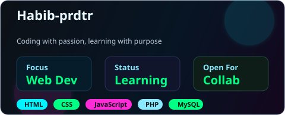
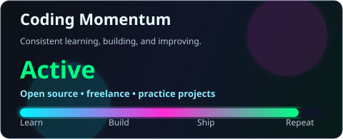
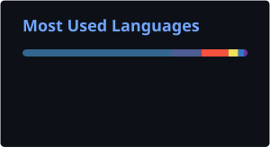

  

  

  

  

---

## 👨‍💻 Tentang Saya

  <table>
    <tr>
      <td width="60%">
        <ul>
          <li>🌱 Saat ini sedang fokus <b>upgrade skill</b> dan memperdalam pengetahuan di bidang teknologi.</li>
          <li>🤝 Terbuka untuk <b>kolaborasi</b> pada proyek open source atau freelance.</li>
          <li>😄 Pronouns: <b>he/him</b></li>
          <li>💬 Selalu antusias ngobrol seputar <b>pemrograman</b>, <b>teknologi</b>, dan inovasi terbaru.</li>
          <li>⚡ Fun Fact: <i>"Saya percaya ngoding itu menyenangkan... selama tidak ada error 😁"</i></li>
        </ul>
      </td>
      <td width="40%" align="center">
        
      </td>
    </tr>
  </table>

---

## 🛠️ Tech Stack & Tools

  

---

## 📊 GitHub Analytics

  
  

  

---

## 💡 Programming Quote

  

---

## 📈 Activity Graph

  

---

## 📫 Let's Connect

  

  

